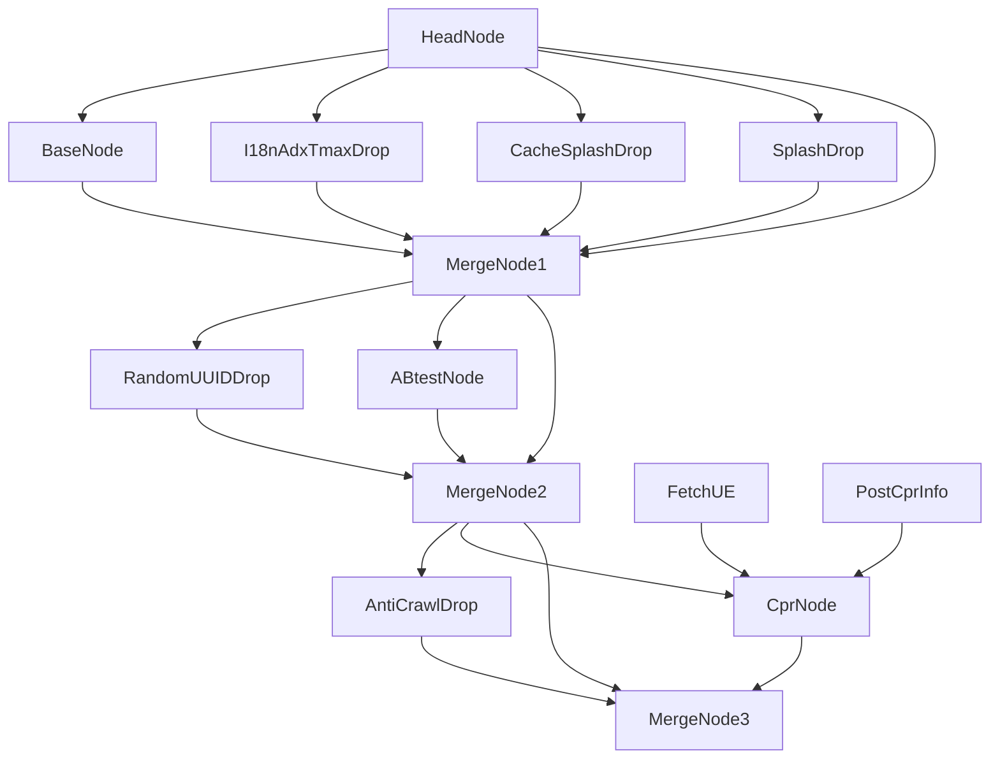

# MermaidDAG
api context_builder

```mermaid
graph TD;
    HeadNode-->BaseNode;
    HeadNode-->I18nAdxTmaxDrop;
    HeadNode-->CacheSplashDrop;
    HeadNode-->SplashDrop;
    I18nAdxTmaxDrop-->MergeNode1;
    CacheSplashDrop-->MergeNode1;
    SplashDrop-->MergeNode1;
    BaseNode-->MergeNode1;
    HeadNode-->MergeNode1;
    MergeNode1-->RandomUUIDDrop;
    MergeNode1-->ABtestNode;
    RandomUUIDDrop-->MergeNode2;
    ABtestNode-->MergeNode2;
    MergeNode1-->MergeNode2;
    MergeNode2-->AntiCrawlDrop;
    MergeNode2-->CprNode;
    FetchUE-->CprNode;
    PostCprInfo-->CprNode;
    AntiCrawlDrop-->MergeNode3;
    CprNode-->MergeNode3;
    MergeNode2-->MergeNode3;
```
